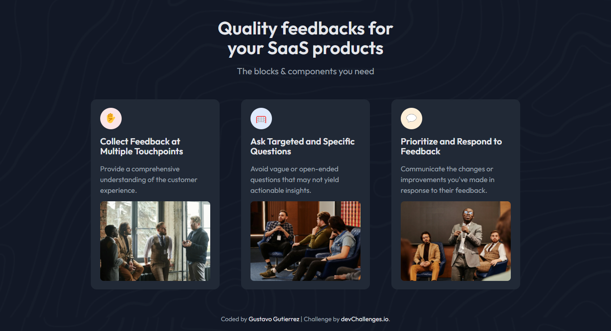

<!-- Please update value in the {}  -->

<h1 align="center">Simple Feature Section | devChallenges</h1>

   Solution for a challenge <a href="https://devchallenges.io/challenge/simple-feature-section-challenge" target="_blank">Simple Feature Section</a> from <a href="http://devchallenges.io" target="_blank">devChallenges.io</a>.

  <h3>
    <a href="https://gustavo2023.github.io/simple-feature-section/">
      Demo
    </a>
     | 
    <a href="{https://your-url-to-the-solution}">
      Solution
    </a>
     | 
    <a href="https://devchallenges.io/challenge/simple-feature-section-challenge">
      Challenge
    </a>
  </h3>

<!-- TABLE OF CONTENTS -->

## Table of Contents

- [Overview](#overview)
  - [What I learned](#what-i-learned)
  - [Useful resources](#useful-resources)
- [Built with](#built-with)
- [Features](#features)
- [Contact](#contact)
- [Acknowledgements](#acknowledgements)

<!-- OVERVIEW -->

## Overview

### What I learned

In this project, I deepened my understanding of CSS Grid. Here are some key takeaways:

- **Grid Layout**: I learned how to create a responsive grid layout using the `grid-template-columns` property to define the number and size of columns.
- **Media Queries**: I applied media queries to adjust the grid layout for different screen sizes, ensuring a responsive design.
- **Grid Item Placement**: I used properties like `grid-column` to control the placement and spanning of grid items across multiple columns and rows.
- **Alignment**: I learned how to center grid items using properties like `justify-self` and `align-self`.

Overall, CSS Grid provided a powerful and flexible way to create a responsive and visually appealing layout for the feature section.

### Built with

- Semantic HTML5 markup
- CSS custom properties
- Flexbox
- CSS Grid

## Features

Simple page that contains a section of feature cards with hover effect.

This application/site was created as a submission to a [DevChallenges](https://devchallenges.io/challenges-dashboard) challenge.

## Author

- GitHub [@gustavo2023](https://github.com/gustavo2023)
